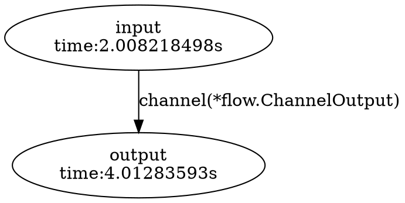

# go-flow

go-flow is a Golang library that helps you to create a complex flow of batch jobs.

## Example

### Channel based flow

```go
in := flow.NewTask(
    "input",
    flow.WithOutputs(flow.NewChannelOutput("channel", make(chan interface{}, 1))),
    flow.WithProcessor(func(tk flow.Task) error {
        for i := 0; i < 10; i++ {
            tk.Out().Write(i)
        }
        return nil
    }),
)
out := flow.NewTask(
    "output",
    flow.WithInputs(in.Out()),
    flow.WithProcessor(func(tk flow.Task) error {
        for it := range tk.In().Channel() {
            time.Sleep(time.Second)
            log.Println(it.(int))
        }
        return nil
    }),
    flow.WithWorker(3), // Number of goroutine to process tasks
)
res, err := flow.Run(out)
if err != nil {
    panic(err)
}
SaveFile("/path/to/graph.dot", res.Graph())
```

```bash
$ go run examples/channel.go
2017/03/30 10:45:55 task 'output' is ready?
2017/03/30 10:45:55 task 'input' is ready?
2017/03/30 10:45:55 task 'input' is started
2017/03/30 10:45:55 task 'output' is started
2017/03/30 10:45:56 0
2017/03/30 10:45:56 2
2017/03/30 10:45:56 1
2017/03/30 10:45:57 3
2017/03/30 10:45:57 5
2017/03/30 10:45:57 4
2017/03/30 10:45:58 8
2017/03/30 10:45:58 6
2017/03/30 10:45:58 7
2017/03/30 10:45:59 9
```

Result.Graph() returns a graph string string which is written by dot language.



You can use Graphviz to can render a graph image using this string.

```
$ dot -Tpng graph.dot -o graph.png
```


## Q&A

* Can I disable debug log output?

  You could disable log output to set your logger to `flow.Logger`.
  ```go
  flow.Logger = log.New(ioutil.Discard, "", log.LstdFlags)
  ```

## Author

**Jun Kimura**

* <http://github.com/bluele>
* <junkxdev@gmail.com>
